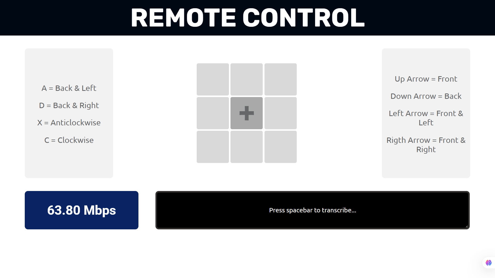

# Wifi-Bot

This project sets up a WebSocket and HTTP server on an ESP32 to enable real-time remote control of a robot via a web interface. It listens for keyboard commands through the WebSocket that correspond to movement commands (e.g., forward, backward, diagonal, or rotational directions) and updates a shared command structure (comms_val) accordingly. The HTTP server serves an initial web page and handles WebSocket upgrade requests, while separate FreeRTOS tasks manage client connections and request handling.

---

## Features

-  Wi-Fi AP/STA modes supported
-  Web interface hosted on ESP32
-  Real-time control using keyboard keys
-  Dual-motor control
-  Battery-powered and portable

---

## Simulation

### Following are the available keyboard commands:

- **Up Arrow** - Forward
- **Down Arrow** - Backward
- **Left Arrow** - Front and Left
- **Right Arrow** - Front and Right
- **A** : Back and Left
- **D** : Back and Right
- **X** : Anticlockwise
- **C** : Clockwise
- **Spacebar** : Speech to text (redundant)
- **I** : Get WiFi Speed

---

## Project Workflow

- Learned about WebSocket communication and how to implement it on the ESP32 for real-time interaction.
- Designed a web server for keyboard input that accepts keyboard inputs and sends corresponding control commands to the robot.
- Implemented dual motor control logic to move the robot in different directions based on received keyboard commands from the WebSocket connection.
- Designed and integrated better graphics on the web server for a more intuitive and engaging user experience.
- Incorporated a speech-to-text module to allow future voice commands for controlling the robot’s movement, expanding its usability.

---

## Prerequisites

- ESP32 development board.
- ESP-IDF development environment set up on your system.
